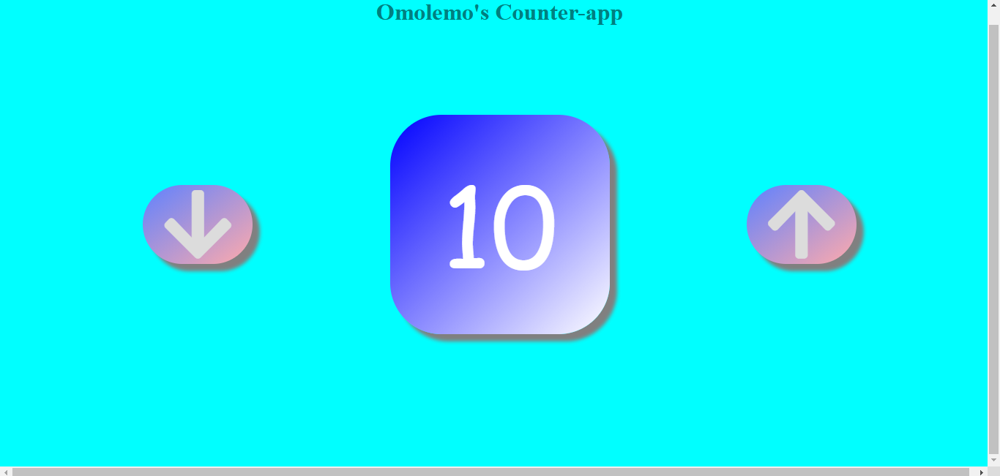

## Omolemo's Counter App

This is a simple counter app made from Javascipt. I used this project to learn how to use DOM events.

## Project Screenshots


## Built With

* Visual Studio Code
* CSS
* HTML
* JavaScript

## Tested With
Live Server

## Getting Started

To get a local copy up and running follow these simple steps.

### Prerequisites:
* Code Editor of your choice

### To clone the repo to your local repository:

``` bash
git clone https://github.com/OmolemoBlessingLethuloe/Counter-app.git
``` 

``` bash
cd Counter-app
```

Open ``` index.html ``` in your preferred browser.

## Authors
OmolemoBlessingLethuloe

## Show your support!
Please give me a ⭐ if you like this project!